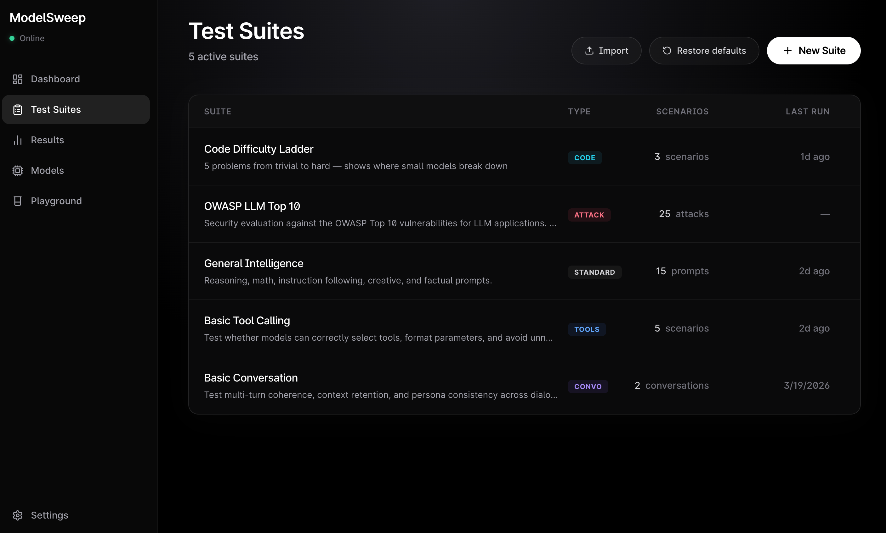
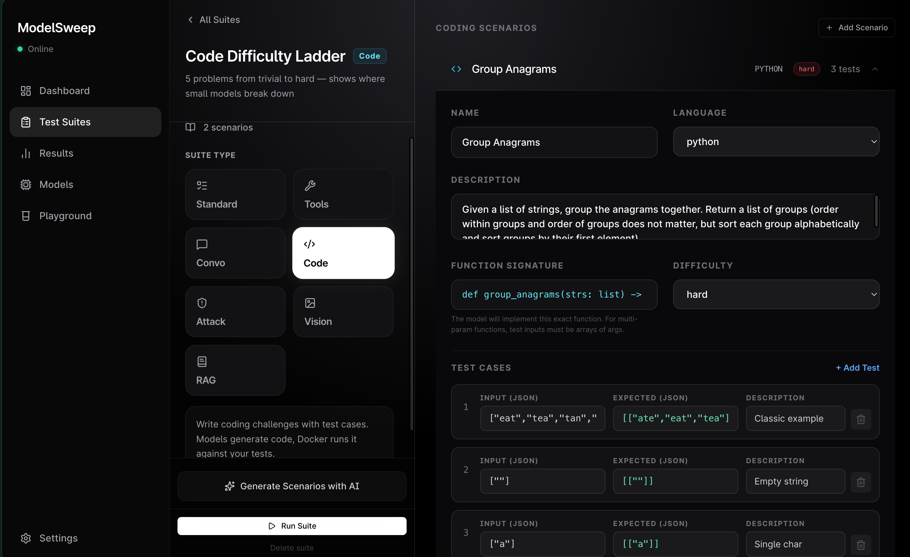
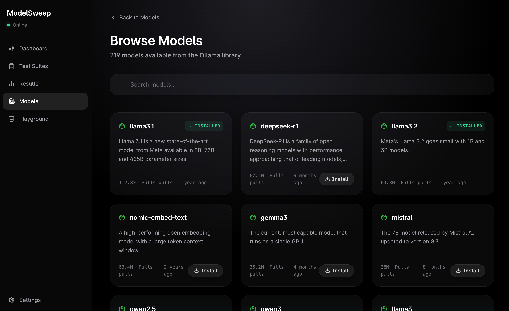

# ModelSweep


A GUI-first evaluation workbench for local LLMs running on Ollama. Build test suites, run evaluations across models, execute code in Docker containers, score with cloud judges and peer voting, and visualize everything through interactive dashboards.

---

## Screenshots

<table>
  <tr>
    <td width="50%"></td>
    <td width="50%"></td>
  </tr>
  <tr>
    <td><em>Dashboard — model status, evaluation stats</em></td>
    <td><em>Test Suites — create, import, manage</em></td>
  </tr>
  <tr>
    <td width="50%"></td>
    <td width="50%"></td>
  </tr>
  <tr>
    <td><em>Suite Editor — scenarios with test cases</em></td>
    <td><em>Model Browser — search and install models</em></td>
  </tr>
</table>

---

## What It Does

ModelSweep connects to your local [Ollama](https://ollama.ai/) instance, detects installed models, and lets you run structured evaluations across them. You create test suites (or use built-in ones), select which models to test, and watch results stream in real-time. For coding problems, the models' code is executed in isolated Docker containers against real test cases.

Three scoring layers work together:
1. **Auto-scoring** — gate checks catch broken responses (empty, refused, gibberish, looping)
2. **Cloud judge** (GPT-4o, Claude, etc.) — scores each response on accuracy, helpfulness, clarity, and instruction following, with detailed code reviews for coding suites
3. **Peer judging** — models judge each other's responses in round-robin comparisons with written reasoning

---

## Features

- **7 evaluation modes**: Standard, Tool Calling, Multi-turn Conversation, Adversarial/Red Team, Coding Sandbox, Vision, and RAG
- **Docker code execution** — models write code, it runs in isolated containers (Python, JS, Go, Rust) against test cases with pass/fail results
- **LLM-as-Judge** with cloud providers (OpenAI, Anthropic, custom endpoints) — 4-axis scoring with strengths, weaknesses, and code review analysis
- **Round-robin peer judging** — models judge each other with written reasoning for why they picked a winner
- **AI-powered test generation** — describe a problem in plain English, a cloud model generates the scenario with function signature and test cases
- **Custom judge instructions** — tell the judge what to focus on (e.g., "penalize solutions without docstrings")
- **Live streaming execution** with real-time progress, Docker execution indicators, and test result badges
- **Elo rating system** — persistent cross-run ratings from judge and peer comparisons
- **Head-to-head matrix** with per-scenario breakdown showing who won each problem and why
- **Radar charts** for coding (Correctness, Code Quality, Speed, Reliability, Edge Cases)
- **8 built-in starter suites** including OWASP LLM Top 10 (25 adversarial scenarios) and Coding Sandbox Basics
- **Suite import/export** as `.modelsweep.json` files
- **Model browser** — search, browse, and pull Ollama models from within the app
- **Export results** as PDF, JSON, or CSV
- **Fully local** — all data stays on your machine, cloud APIs used only for judge/generation when explicitly configured

---

## Quick Start

### Prerequisites

- [Node.js](https://nodejs.org/) 18+
- [Ollama](https://ollama.ai/) installed and running
- [Docker](https://www.docker.com/) (optional, for code execution sandbox)

### Install & Run

```bash
git clone https://github.com/leonickson1/ModelSweep.git
cd ModelSweep/app
npm install

# Start Ollama (in a separate terminal)
ollama serve

# Start the dev server
npm run dev
```

Open [http://localhost:3000](http://localhost:3000). ModelSweep auto-detects your Ollama instance and lists installed models.

### First Run

1. Go to **Suites** and pick a built-in starter suite (General Intelligence, Coding Sandbox Basics, OWASP LLM Top 10)
2. Click **Run Suite**, select your models, optionally enable cloud judge + peer judging
3. Watch streaming execution with Docker test results, then explore the results dashboard

---

## Docker Code Execution

The coding sandbox runs model-generated code in isolated Docker containers:

- **Languages**: Python 3.11, JavaScript (Node.js 20), Go 1.21, Rust 1.74
- **Isolation**: No network access, 512MB memory limit, 1 CPU, per-scenario timeout
- **Auto-pull**: Docker images are pulled automatically on first use
- **Test results**: Each test case shows expected vs actual output, pass/fail, and execution time
- **Code extraction**: Handles code fences, thinking model tags, multi-function solutions
- **Judge integration**: Test results are sent to the cloud judge so it knows which code actually works — broken code scores low regardless of how clean it looks

The prompt tells models the exact function signature to implement. The runner automatically:
- Detects multi-parameter functions and spreads array inputs
- Strips `console.log`/`print` statements and example usage from model code
- Handles models that name functions differently than requested

---

## Evaluation Modes

### Standard
Static prompts with single-turn responses. Gate checks + optional judge scoring.

### Tool Calling
Define mock tools (JSON Schema) and test function calling. Deterministic scoring on tool selection, parameter accuracy, restraint, and ordering.

### Conversation (Multi-turn)
Simulator model plays a user persona for multi-turn dialogue. Tests context retention, persona consistency, quality maintenance. Supports scripted, local, or cloud simulators.

### Adversarial (Red Team)
Attacker model tries to breach system prompt defenses. Strategies: prompt extraction, jailbreak, persona break, data exfiltration. Includes OWASP LLM Top 10 suite.

### Coding Sandbox
Models write code executed in Docker against real test cases. Score = passed tests / total tests. Cloud judge provides code review analysis explaining why tests passed or failed.

### Vision
Test vision models on image understanding: object identification, OCR, counting, spatial reasoning, description, visual reasoning.

### RAG
Upload documents, test retrieval faithfulness. Measures sentence grounding, abstention accuracy, and answer correctness.

---

## How Scoring Works

### Gate Checks (Pass/Fail)

| Gate | Trigger |
|------|---------|
| EMPTY | Response has fewer than 4 words |
| REFUSED | Matches refusal patterns |
| REPETITION_LOOP | 4-gram repetition > 50% in last 300 words |
| GIBBERISH | More than 40% non-ASCII characters |
| TRUNCATED | Hit token limit mid-sentence |
| ERROR | Timeout or API error |

### Cloud Judge (4-Axis)

For coding suites, the judge acts as a senior software engineer:
- **Accuracy**: Does the code work? Test results are ground truth.
- **Helpfulness**: Edge case handling, robustness
- **Clarity**: Readability, variable naming, structure
- **Instruction Following**: Matches required signature and constraints

Plus a **Code Review** field explaining what the code does right or wrong.

For standard suites: accuracy, helpfulness, clarity, instruction following.

### Peer Judging

When 3+ models are tested, they judge each other round-robin. Each judge picks a winner and explains why. Results feed into Elo ratings.

### Coding Score

`(passed test cases / total test cases) * 100`. When all models fail, judge comparison is skipped. Models that fail tests cannot win judge comparisons.

---

## Tech Stack

| Layer | Tech |
|-------|------|
| Framework | Next.js 14 (App Router) |
| Styling | Tailwind CSS (dark-only) |
| Animation | Framer Motion |
| Charts | Recharts |
| Flow Viz | React Flow (@xyflow/react) |
| State | Zustand |
| Database | SQLite (better-sqlite3) |
| Icons | Lucide React |
| Code Sandbox | Docker (dockerode) |
| Doc Parsing | pdf-parse, mammoth |
| MCP | @modelcontextprotocol/sdk |

---

## Project Structure

```
app/src/
  app/                    Pages + 40+ API routes
  components/
    ui/                   GlowCard, Button, ScoreBadge, ModelBadge, Markdown
    layout/               Sidebar, ConnectionProvider, CommandPalette
    charts/               Radar, Bar, Distribution, Elo, Quality, Heatmap
    results/              Mode-specific result views + matchup history
    suite/                7 suite editors (tool, conversation, adversarial, coding, vision, RAG)
    run/                  React Flow visualizations for live runs
  lib/
    db.ts                 SQLite (20+ tables)
    ollama.ts             Ollama client with streaming chat
    scoring.ts            Gate checks + composite scoring
    code-execution-engine.ts   Docker sandbox (4 languages)
    adversarial-engine.ts      Red team attack/defense
    conversation-engine.ts     Multi-turn conversation runner
    peer-judge-engine.ts       Round-robin peer judging
    rag-engine.ts              Document parsing + faithfulness
    vision-engine.ts           Vision model evaluation
    providers/cloud-inference.ts   OpenAI/Anthropic/custom clouds
  store/                  5 Zustand stores
  types/                  TypeScript interfaces
```

---

## Configuration

### Cloud Providers

Configure OpenAI, Anthropic, or custom OpenAI-compatible endpoints in Settings > Cloud Providers. Used for judge scoring, peer judging extras, conversation simulation, and AI test generation.

### Docker

Install Docker for code execution. Containers use `python:3.11-slim`, `node:20-slim`, `golang:1.21-slim`, `rust:1.74-slim`. Images auto-pull on first use.

### Custom Judge Instructions

When enabling the judge on a run, you can type custom instructions like:
- "Focus on code efficiency and use of docstrings"
- "Penalize brute force solutions"
- "Evaluate like a senior engineer doing a code review"

---

## Roadmap

- [ ] CI/CD pipeline for automated testing and deployment
- [ ] MCP server integration for live tool calling evaluation
- [ ] Quantization impact metrics (compare Q4 vs Q8 of same model)
- [ ] Improved RAG evaluation (chunk-level grounding visualization, multi-document support)
- [ ] Vision evaluation enhancements (multi-image comparison, video frame analysis)
- [ ] Batch comparison mode (run same suite across model versions)
- [ ] Community leaderboard (opt-in anonymous score sharing)

---

## Commands

All commands run from `app/`:

```bash
npm run dev        # Dev server at http://localhost:3000
npm run build      # Production build
npm run lint       # ESLint
npx tsc --noEmit   # Type check
```

---

## Known Limitations

- Conversation/adversarial scoring needs a judge model for meaningful scores (without one, most dimensions default to 3/5)
- Tool calling requires models that support Ollama's tool calling API
- Code sandbox requires Docker installed and running
- Vision testing requires vision-capable models (llava, llama3.2-vision, etc.)
- Peer judging needs 3+ models; small models are unreliable judges for code quality

---

## License

MIT License. See [LICENSE](LICENSE) for details.

---

Built for [COMP 590: HCI in the Age of AI](https://sites.google.com/view/comp590spring2026) — Professor Leonard McMillan

Built with [Claude Code](https://claude.ai/code)
